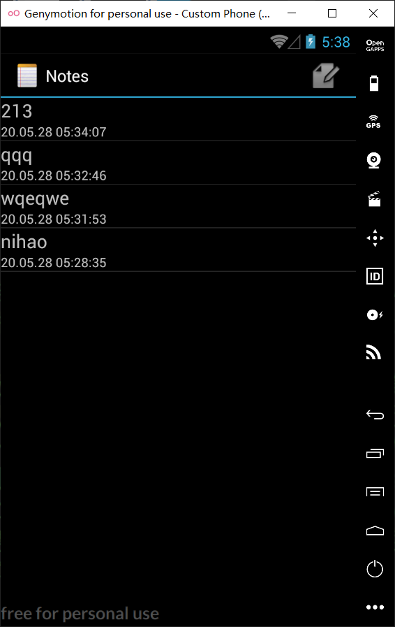
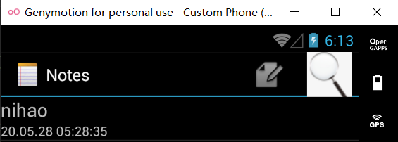
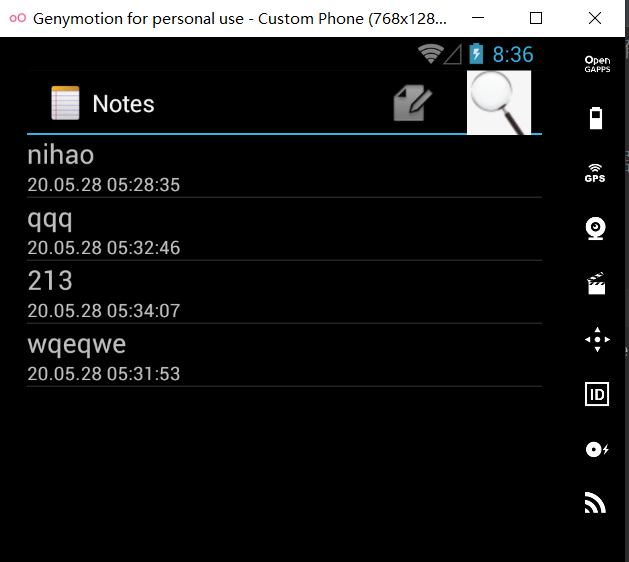
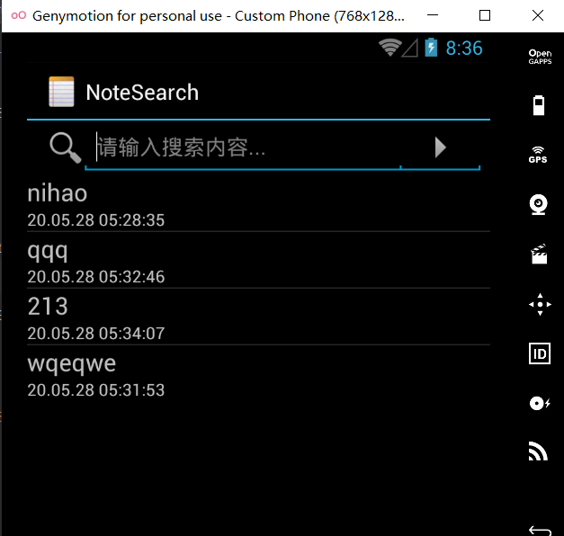
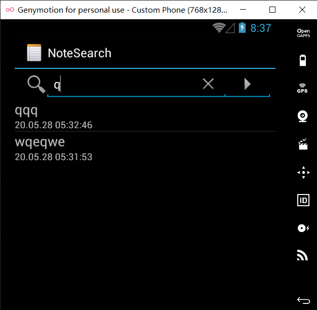
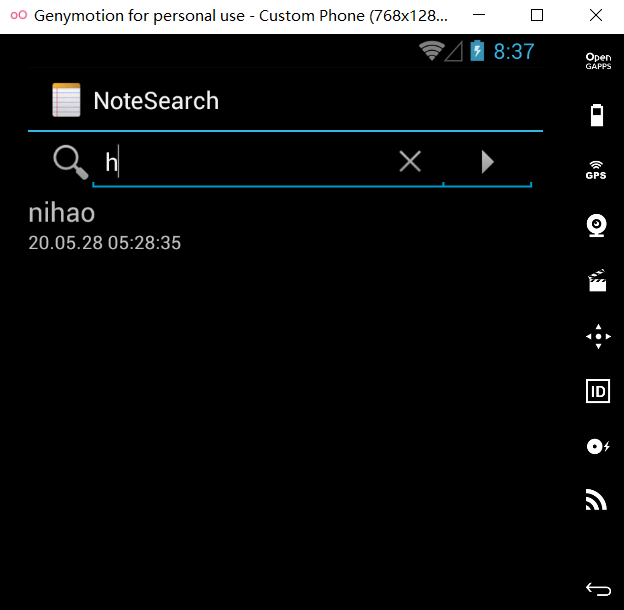

## 一.项目导入

原本我电脑上安装的是Android Studio3.6版本，一顿操作之后发现无法适配这个项目，于是安装了3.5版本。

安装之后还是有一系列大大小小的问题，比如gradle的版本与系统不一致什么的，所幸修改之后能够成功运行

## 二.时间戳的实现

#### 1.在每个note的item上增加时间戳显示控件

需要修改原本的TextView为LinearLayout布局，这样就能新增一个TextView用来显示时间戳

noteslist_item.xml

```
<?xml version="1.0" encoding="utf-8"?>
<LinearLayout xmlns:android="http://schemas.android.com/apk/res/android"
    xmlns:tools="http://schemas.android.com/tools"
    android:layout_width="match_parent"
    android:layout_height="wrap_content"
    android:orientation="vertical"
    tools:ignore="MissingDefaultResource">

    <TextView
        android:id="@android:id/text1"
        android:layout_width="match_parent"
        android:layout_height="wrap_content"
        android:textSize="20sp"
        />
    <TextView
        android:id="@+id/time1"
        android:layout_width="match_parent"
        android:layout_height="wrap_content"
        />
</LinearLayout>
```

#### 2.增加COLUMN_NAME_MODIFICATION_DATE并修改存储格式

因为在NotePad.java中原本就有COLUMN_NAME_CREATE_DATE属性和COLUMN_NAME_MODIFICATION_DATE属性，因此只需在NoteList.java中增加对应属性即可使用。

```
 private static final String[] PROJECTION = new String[] {
            NotePad.Notes._ID, // 0
            NotePad.Notes.COLUMN_NAME_TITLE, // 1
            NotePad.Notes.COLUMN_NAME_MODIFICATION_DATE,//2
            NotePad.Notes.COLUMN_NAME_CREATE_DATE,//3
    };
```

还没结束，因为默认的NotePadProvider.java设定中，日期时间是按照Long类型来存储的，直接输出会显示数字乱码，需要将其修改为String格式，通过Date()类获取当前日期，用format进行加工。

```
//Gets the current system time in milliseconds
//Long now = Long.valueOf(System.currentTimeMillis());
SimpleDateFormat format = new SimpleDateFormat("yy.MM.dd HH:mm:ss");
String now = format.format(new Date());
```

#### 3.将数据库中存储的日期映射到item上新增的时间戳上

这里的dataColumns与viewIDs是相对应的，所以COLUMN_NAME_CREATE_DATE会自动映射到R.id.time1上，也就是时间戳

```
String[] dataColumns = { NotePad.Notes.COLUMN_NAME_TITLE,NotePad.Notes.COLUMN_NAME_CREATE_DATE};
        int[] viewIDs = { android.R.id.text1,R.id.time1};
        // Creates the backing adapter for the ListView.
        SimpleCursorAdapter adapter
            = new SimpleCursorAdapter(
                      this,                             // The Context for the ListView
                      R.layout.noteslist_item,          // Points to the XML for a list item
                      cursor,                           // The cursor to get items from
                      dataColumns,
                      viewIDs
              );
```

#### 4.实验结果



## 三.搜索框的实现

#### 1.在list_options_menu.xml中添加搜索控件

```
    <item android:id="@+id/menu_search"
        android:icon="@drawable/search"
        android:title="@string/menu_search"
        android:showAsAction="always" />
```

其中icon图标和title都是需要自己额外添加的，通过下图可以看到添加成功了



#### 2.在NoteList.java中添加点击响应事件

```
case R.id.menu_search:
           startActivity(new Intent(Intent.ACTION_SEARCH, getIntent().getData()));
           return true;
```

#### 3.新建note_search.xml文件，用来展示搜索页面

```
<?xml version="1.0" encoding="utf-8"?>
<LinearLayout xmlns:android="http://schemas.android.com/apk/res/android"
    android:orientation="vertical"
    android:layout_width="match_parent"
    android:layout_height="match_parent">
    <SearchView
        android:id="@+id/search_view"
        android:layout_width="match_parent"
        android:layout_height="wrap_content"
        android:queryHint="请输入搜索内容..."
        android:iconifiedByDefault="false"
        >
    </SearchView>
    <ListView
        android:id="@+id/list1"
        android:layout_width="match_parent"
        android:layout_height="wrap_content">
    </ListView>
</LinearLayout>
```

#### 4.新建NoteSearch.java文件，用来处理搜索页面的逻辑

以下是查询数据库的代码，以及一个简单的适配器，我们需要通过ListView来获取搜索页面的搜索列表，并将适配器配置在ListView之上

```
Cursor cursor = managedQuery(
                getIntent().getData(),            // Use the default content URI for the provider.用于ContentProvider查询的URI，从这个URI获取数据
                PROJECTION,                       // Return the note ID and title for each note. and modifcation date.用于标识uri中有哪些columns需要包含在返回的Cursor对象中
                null,                        // 作为查询的过滤参数，也就是过滤出符合selection的数据，类似于SQL的Where语句之后的条件选择
                null,                    // 查询条件参数，配合selection参数使用
                NotePad.Notes.DEFAULT_SORT_ORDER  // Use the default sort order.查询结果的排序方式，按照某个columns来排序，例：String sortOrder = NotePad.Notes.COLUMN_NAME_TITLE
        );

        String[] dataColumns = { NotePad.Notes.COLUMN_NAME_TITLE ,NotePad.Notes.COLUMN_NAME_CREATE_DATE };
        int[] viewIDs = { android.R.id.text1,R.id.time1};
        final SimpleCursorAdapter adapter = new SimpleCursorAdapter(
        this,                   //context:上下文
        R.layout.noteslist_item,         //layout:布局文件，至少有int[]的所有视图
                cursor,                          //cursor：游标
                dataColumns,                     //from：绑定到视图的数据
                viewIDs                          //to:用来展示from数组中数据的视图
        );
ListView listView= findViewById(R.id.list1);
listView.setAdapter(adapter);
```

#### 5.获取searchView对象，该对象有两种方法，分别是输入完成后点击发送按钮后的事件和输入过程中文本框内容改变时的事件，我这里选择配置输入过程中的改变，也就是即使改变

（如果要做发送按钮相应事件，需要使用`searchView.setSubmitButtonEnabled(true);`语句来开启发送按钮）

```
searchView.setOnQueryTextListener(new SearchView.OnQueryTextListener() {
            @Override
            public boolean onQueryTextSubmit(String query) {
                return false;
            }
            @Override
            public boolean onQueryTextChange(String s) {
                Cursor newCursor;

                if (!s.equals("")) {
                    String selection = NotePad.Notes.COLUMN_NAME_TITLE + " GLOB '*" + s + "*'";
                    newCursor = getContentResolver().query(
                            getIntent().getData(),
                            PROJECTION,
                            selection,
                            null,
                            NotePad.Notes.DEFAULT_SORT_ORDER
                    );
                } else {
                    newCursor = getContentResolver().query(
                            getIntent().getData(),
                            PROJECTION,
                            null,
                            null,
                            NotePad.Notes.DEFAULT_SORT_ORDER
                    );
                }
                adapter.swapCursor(newCursor); // 视图将同步更新！
                return true;
            }
        });
```

#### 6.实验结果：








